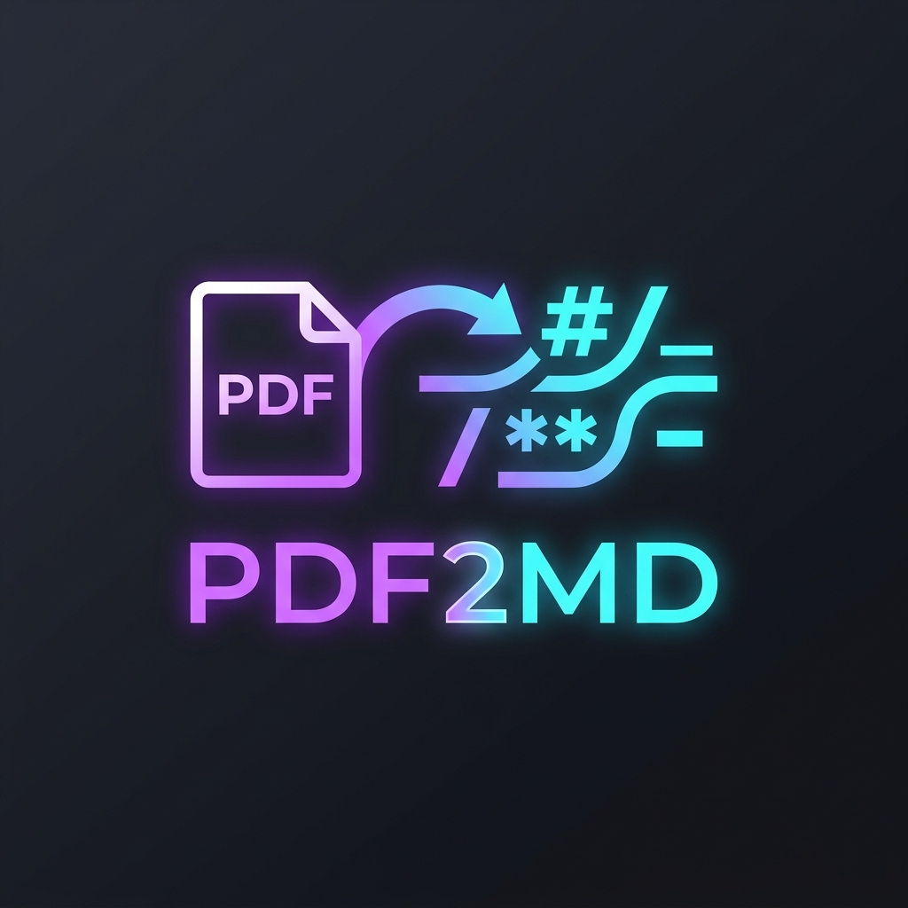

# 🚀 PDF2MD: 高保真 PDF 转 Markdown 系统



**PDF2MD** 是一款基于 **PyMuPDF4LLM** 引擎和 **Gemini 2.5 Flash** 视觉大模型的智能化 PDF 转换工具。它不仅能提取文本，还能精准识别表格、公式，并自动将图片导出为独立的资源包。

---

## ✨ 核心特性

- **📂 自动化资源包管理**：为每个 PDF 自动创建专属文件夹，将 Markdown 文件与图片资源（`images/`）统一归档。
- **🖼️ 视觉图片提取**：利用 PyMuPDF 高级接口，自动从 PDF 中剥离图片并保持高质量 PNG 格式。
- **🤖 Gemini 2.5 Flash 增强**：支持通过最新的 Gemini 模型对提取出的 Markdown 进行逻辑重组、OCR 修复及格式美化。
- **🌈 现代玻璃拟态 UI**：基于 NiceGUI 构建的高级深色模式界面，支持实时转换日志监控。
- **🛠️ 跨平台路径优化**：自动清洗 Windows 非法路径字符，确保复杂文件名的稳定性。

## 🚀 快速开始

### 1. 环境准备
确保你的电脑已安装 Python 3.10+，然后安装依赖：
```bash
pip install -r requirements.txt
```

### 2. 运行应用
```bash
python run.py
```

### 3. 配置与转换
1.  **API Key**: 在侧边栏填入你的 Google Gemini API Key（如需 AI 增强功能）。
2.  **设置路径**: 指定 `Output Directory`（默认为系统下载目录）。
3.  **拖拽转换**: 将 PDF 文件拖入中央区域，系统将自动开始处理。
4.  **自动保存**: 转换完成后，文件已自动保存在指定目录。

## 📁 转换后的结构
转换成功后，你将得到一个整洁的资源文件夹：
```text
输出目录/
└── 量化交易_算法_分析/
    ├── 量化交易_算法_分析.md    <-- 自动引用的相对图片路径
    └── images/                  <-- 文档内所有图片资源
        ├── image-1-1.png
        └── ...
```

## 🛠️ 技术栈
- **Engine**: [PyMuPDF4LLM](https://github.com/pymupdf/pymupdf4llm)
- **GUI**: [NiceGUI](https://nicegui.io/)
- **AI**: [Google Generative AI (Gemini)](https://ai.google.dev/)
- **Styling**: Vanilla CSS + Glassmorphism

---

*Powered by Antigravity AI*
